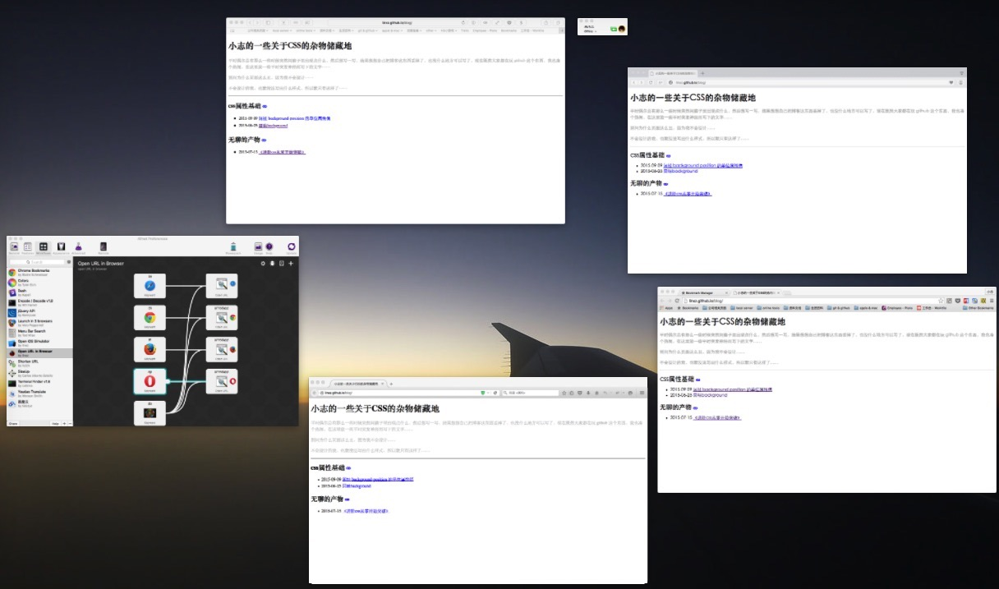

# alfredWorkflow-Open-url-in-Browser-without-http

可以通过 `alfred` 单独打开一个网址，也可以同时让一个网址在多个浏览器中应用。

* `ch` 打开 **Chrome**
* `sa` 打开 **Safari**
* `op` 打开 **Opera**
* `ff` 打开 **Firefox**
* `4b` 同时打开以上四个浏览器

```
快捷方式可自定义修改，如果浏览器有更多的也可以自行继续添加。如果没有浏览器的话，可能就是直接无效，目前我也不知道是什么结果。
```


## 简要说明

没什么太多技术含量的东西在，只是用了 alfred 中的一些东西，然后引用 `{query}` 来直接在浏览器中打开网址。今天突然发现其实可以同时打开多个的，于是就稍微调整一下，然后发出来……

## 截图

就不全部截图了，放同时打开多个浏览器的效果。


打开后



## 下载

直接点击下载，如有需要的话： [Open URL in Browser without http.alfredworkflow](Open URL in Browser without http.alfredworkflow)